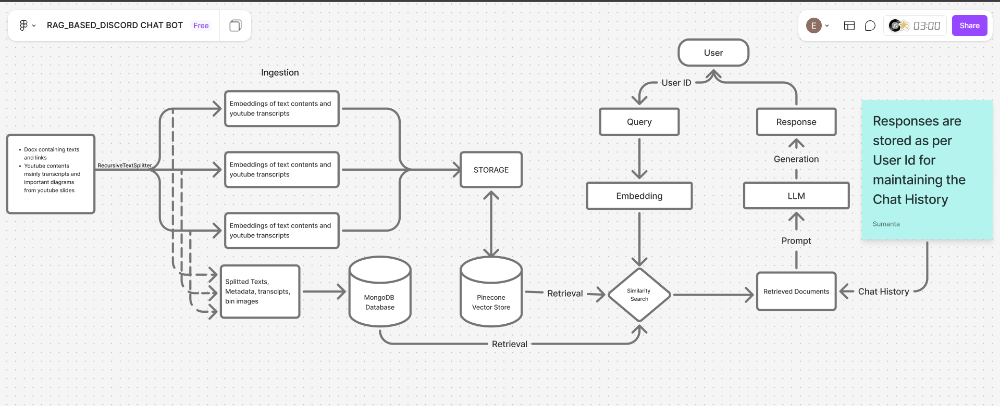

# RAG-Based Chatbot for AI Internship QA

This repository contains a Retrieval-Augmented Generation (RAG) chatbot designed to answer questions about an AI internship program. Leveraging a combination of document ingestion, vector embeddings, and conversational memory, the bot provides contextualized, accurate responses and maintains chat history per user.

---

## 📋 Table of Contents

1. [Overview](#overview)  
2. [Features](#features)  
3. [Architecture & Workflow](#architecture--workflow)  
4. [Prerequisites](#prerequisites)  
5. [Installation](#installation)  


---

## 📝 Overview

The RAG-based chatbot ingests various sources—DOCX documents, YouTube transcripts, and images—stores their embeddings in Pinecone, and raw content/metadata in MongoDB. At query time, it:

1. Generates an embedding for the (history-aware) user question.  
2. Retrieves the top‑k most relevant chunks from Pinecone.  
3. Fetches raw content and metadata from MongoDB.  
4. Constructs a prompt including the retrieved context and chat history.  
5. Calls a chat LLM (e.g., GPT-3.5 or Gemini) to generate an answer.  
6. Updates per-user conversation memory and logs response metadata.  

This system is tailored for interns to quickly find resources, schedules, training documents, and FAQs about the AI internship.

---

## 🚀 Features

- **Document Ingestion**: Parse DOCX files, extract markdown links, YouTube video transcripts, and diagrams.  
- **Vector Embeddings**: Compute and store embeddings with Sentence-Transformers or OpenAI embeddings in Pinecone.  
- **MongoDB Storage**: Keep raw text, metadata, binary images, and manual context annotations.  
- **History-Aware Retrieval**: Use an LLM to refine queries based on recent chat history.  
- **Conversational Memory**: Maintain per-user chat history and response metadata (including extracted keywords).  
- **YouTube Link Utilities**: Extract video IDs, filter YouTube URLs, and handle transcript retrieval gracefully.  

---

## 🏗 Architecture & Workflow



1. **Ingestion**: Split documents, extract content and metadata, embed, and store in Pinecone & MongoDB.  
2. **Retrieval**: On each query, refine it with a history-aware LLM transformer, then perform similarity search.  
3. **Response Generation**: Gather context from MongoDB, build prompt, call chat LLM, and return the answer.  
4. **Memory & Logging**: Append each turn to per-user memory, extract response keywords, and log metadata.  

---

## 🛠 Prerequisites

- Python 3.8+  
- MongoDB Atlas or local MongoDB instance  
- Pinecone account & index  
- YouTube Transcript API (optional)  
- (Optional) Proxy for transcript fetching to avoid IP blocks  

---

## ⚙️ Installation

```bash
# Clone this repo
git clone https://github.com/your-org/rag-internship-chatbot.git
cd rag-internship-chatbot

# Create and activate virtual environment
python -m venv venv
source venv/bin/activate  # Linux/macOS
venv\Scripts\activate     # Windows

# Install dependencies
pip install -r requirements.txt
